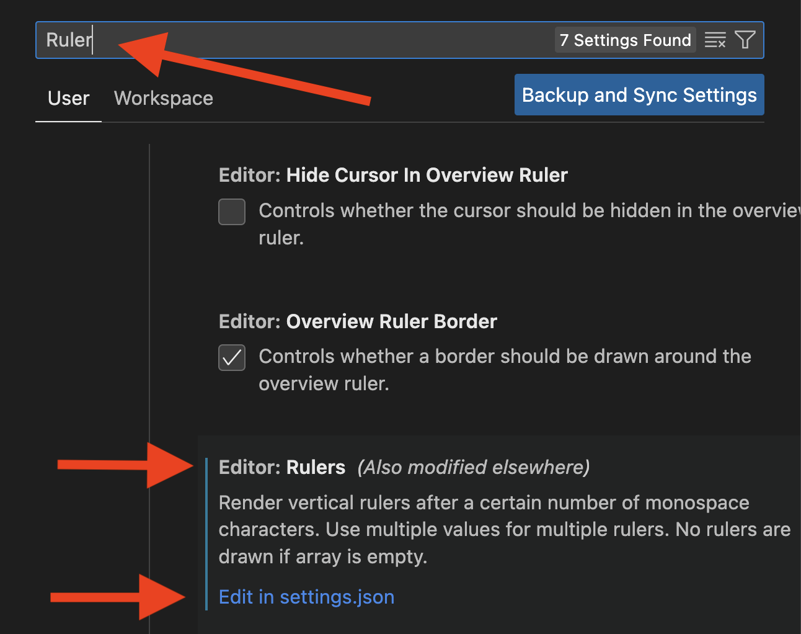

# Adding a ruler to Microsoft Visual Studio

*While you are coding, you can align with Python’s PEP8 style guide by updating the Studio Code IDE with a vertical ruler.*

One of PEP8’s conventions is that the maximum line length is 79 characters. To help you stick to this convention,  you can set up a ruler in Visual Studio Code.


As you can see in the screen shot above, the line will show up in any type of file (Markdown `.md` in this example) but you can turn off the line when you are not coding in Python. (I normally will just leave it on.)

## How to add vertical ruler

### Settings

You need to find settings. Visual Studio Code is mostly the same between Mac and Windows, but menus are hard to keep consistent across OS platforms, but once you find the Settings Panel, it will be the same on Mac and PC.

#### In Mac

`Code > Settings > Settings` or use shortcut `Command + ,`

#### In Windows

`File > Preferences > Settings` or use shortcut `Control + ,`

When you get to settings, Search for `Rulers` then scroll down and find 

>Editor:*Rulers*  
then    
Edit in `settings.json`

**Click the settings.json link**



`settings.json` will open.

Your settings file may have a few lines of settings or a lot of lines of settings, but find the line with the `"editor.rulers":` setting and edit it to look like this:

```
{
    "editor.rulers": [79]
}
```

If you only have one setting in the brackets, you do not need a comma as shown below. You also do not need a comma if it is the last entry before the final `}`, But if it is in the middle of a list of settings, you will need a comma.

```
"git.openRepositoryInParentFolders": "never",
    "[python]": {
        "editor.formatOnType": true
    },
    "editor.minimap.showSlider": "always",
    "editor.rulers": [79],
    "files.autoSave": "afterDelay",
    "editor.minimap.enabled": false,
    ```

    If you ever want to remove the vertical ruler, you may edit the settings and just leave it blank:

    ```
     "editor.rulers": []
    ```

After you have your ruler turned on, go into your assignment_01 folder on your computer and code up this example. Once you have it all done, take a screen shot of your code same as the sample below. Then you should drag it and drop it into your Assignment01_folder on GitHub.
